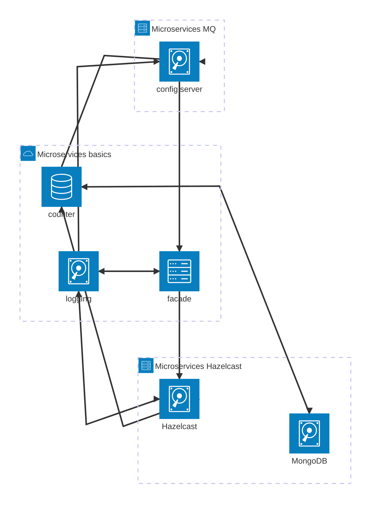

# Microservices

## Architecture



## Structure

Most importantly:

```text
.
├── client.py                   # client script
├── demo.sh                     # used for functionality demo in report
├── docker-bake.hcl             # alternative to compose build
├── docker-compose.yaml
├── Dockerfile
├── dsd1client.sh               # shell client function
├── .env.example                # example .env with required vars 
├── packages                    # shared dependencies of services
│   └── config-server-client    # custom config server client
├── pyproject.toml              # shared dev dependencies
├── services                    # service implementations
│   ├── config-server           # custom config server
│   ├── countersvc
│   ├── facade
│   └── logsvc
└── stats.py                    # Count averages from scenario CSV
```
