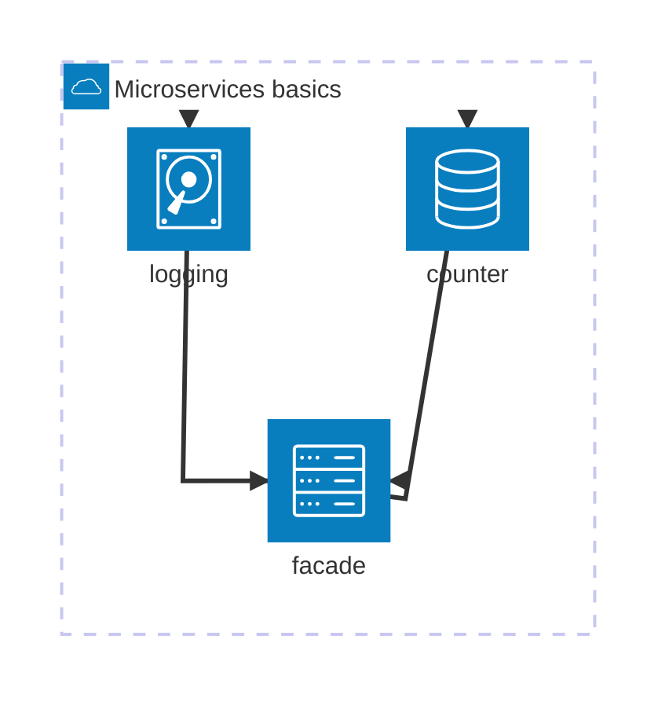

# Microservices basics (lab 1)

```mermaid
architecture-beta
    group lab1(cloud)[Microservices basics]

    service facade(server)[facade] in lab1
    service counter(database)[counter] in lab1
    service logging(disk)[logging] in lab1

   facade:L <--> T:counter
   facade:R <--> T:logging
```
