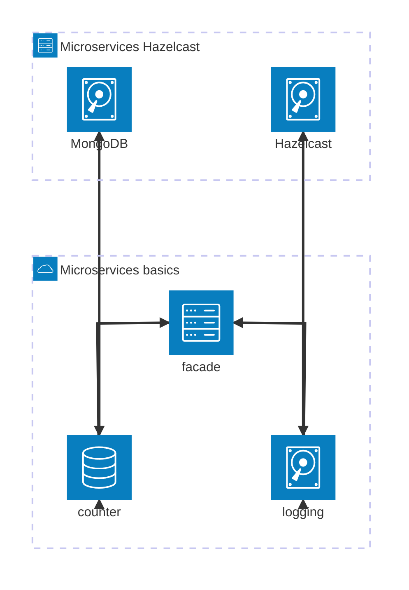

# Microservices basics (lab 1)

## Architecture



## Structure

Most importantly:

```text
.
├── client.py             # client script
├── demo.sh               # used for functionality demo in report
├── docker-bake.hcl       # alternative to compose build
├── docker-compose.yaml
├── Dockerfile
├── dsd1client.sh         # shell client function
├── .env.example          # example .env with required vars 
├── pyproject.toml        # shared dependencies, can use with client.py e.g. via `poetry shell` 
├── services              # service implementations
│   ├── countersvc
│   ├── facade
│   └── logsvc
└── stats.py              # Count averages from scenario CSV
```
